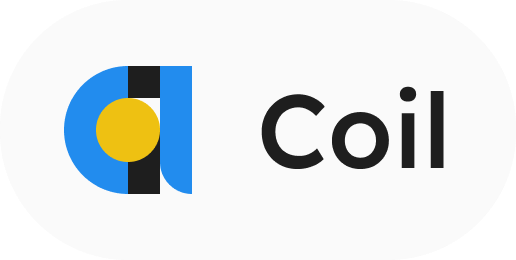

    

<h1 align="center">The Coil Programming Language</h1>

The Coil Programming Language is a language that aims to be maximally efficient while prioritizing ease of use and learning.

## 🎯 Implementation Progress

- ✔️ Lexer
- ❌ Parser
- ❌ Backend
- ❌ Standard Library

## 🤝 Contributing

Feel free to contribute to the project via opening issues or sending pull requests.
